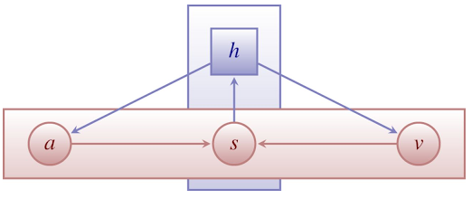
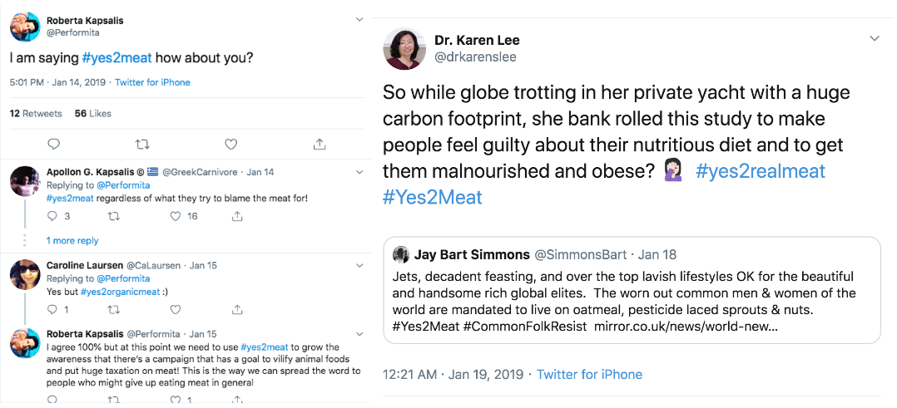
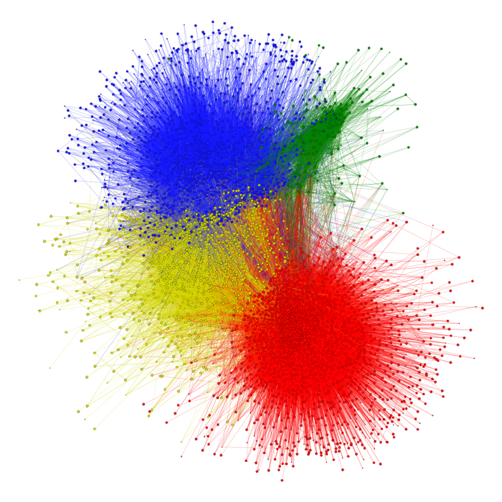
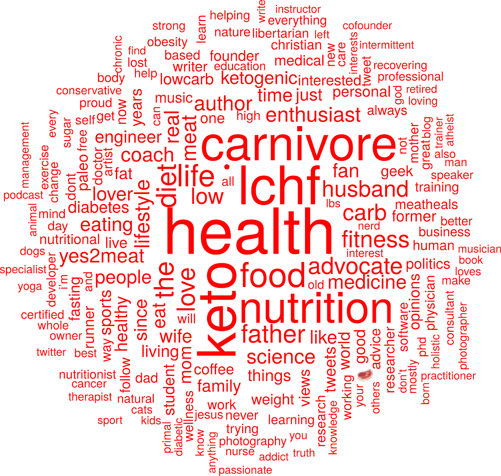

```{r xaringan-themer, include=FALSE, warning=FALSE}
#This block contains the theme configuration for the CSS lab slides style
library(xaringanthemer)
library(showtext)
style_mono_accent(
  base_color = "#5c5c5c",
  text_font_size = "1.5rem",
  header_font_google = google_font("Arial"),
  text_font_google   = google_font("Arial", "300", "300i"),
  code_font_google   = google_font("Fira Mono")
)
```

```{r setup, include=FALSE}
options(htmltools.dir.version = FALSE)
```


layout: true
<div class="my-footer"><span>David Garcia - Introduction to Computational Social Systems</span></div> 

---

## The Computational Social Science Lab
<center>
```{r, echo=FALSE, out.width=950}

```
---

# Outline

</br>

## 1. Collective Emotions in Social Media

## 2. Emerging Polarization: The EAT-Lancet case

## 3. Research Topics at the CSS Lab @ TU Graz

---


layout: true
<div class="my-footer"><span>
<a href=https://doi.org/10.1177%2F0956797619831964> Collective Emotions and Social Resilience in the Digital Traces After a Terrorist Attack. David Garcia Bernard Rimé. Psychological Science (2019)</a></span></div> 

---

## The Social Function of Collective Emotions

<center>
```{r, echo=FALSE, out.width=900}
knitr::include_graphics("figures/ColectiveEmotions.png")
```
</center>

- **Theory of collective effervescence** (Durkheim, 1912):
Shared emotions generate social identity, reinforce shared beliefs, and lead to higher solidarity

- **Collective emotions** (von Scheve and Salmela, 2014):   
Emotional states shared by a large amount of people at the same time


---

background-size: 40%
background-image: url(figures/Trauma.png)
background-position: 90% 60%


## Emotional Responses to Collective Traumas

**How do societies respond to traumatic events?**  
**Is there a social function of collective emotions?**
.pull-left[
- Emotional synchronization: Experience of simultaneous negative emotions

- Collective emotion lasts longer than individual emotional reactions

- Individuals that participate in the collective emotions show higher levels of long-term solidarity ]

---


## Twitter Digital Traces after a Terrorist Attack

Focus on Paris Attacks of of Nov 13, 2015  
Removed bots, news media, and organizations. Final sample of 62,114 users  
Retrieved historical timeline of users. Total of more than 27 Million tweets (no RT)
<center>
```{r, echo=FALSE, out.width=900}
knitr::include_graphics("figures/ParisCase.png")
```

---

## Linguistic Signals

**Linguistic Inquiry and Word Count, LIWC (pronounced “Luke”)**  
- Simple word matching method  
- Generated and validated by psychologists (Pennebaker et al., 2001-2015)
- Multiple classes, calibrated for netspeak and neologisms


.pull-left[
```{r, echo=FALSE, out.width=1000}
knitr::include_graphics("figures/LIWC.png")
```
]
.pull-right[
**LIWC classes in this study:**  
Positive Affect, Negative Affect  
Anxiety, Sadness, Anger  
Social processes  
Prosocial terms (Frimer, et. al, 2014)  
French values (libert\*, egalit\*, fraternit\*)
]

---

## Agent-Based Modelling of Collective Emotions

.pull-left[
```{r, echo=FALSE, out.width=1000}

```

ABM calibrated with experiment data
- φ: post-shock AR(1) term
- φ~0: subcritical response
- φ>0: critical, collective behavior
]

.pull-right[
```{r, echo=FALSE, out.width=450}
knitr::include_graphics("figures/Simulation.png")
```
<center>
Mean valence in simulations
</center>
]

<div style="font-size:14pt">
[The Dynamics of Emotions in Online Interaction. Garcia et al. Royal Society Open Science 3 (2016)](https://royalsocietypublishing.org/doi/full/10.1098/rsos.160059)

---

## Evidence of Collective Emotions
<center>
```{r, echo=FALSE, out.width=750}
knitr::include_graphics("figures/TS.png")
```
</center>

---

### Collective Dynamics of Social Resilience Indicators
<center>
```{r, echo=FALSE, out.width=720}
knitr::include_graphics("figures/TS2.png")
```
</center>


---

## Emotional Synchronization Effect

.pull-left[
<center>
```{r, echo=FALSE, out.width=470}
knitr::include_graphics("figures/TS3.png")
```
</center>
]

.pull-right[
Division of users into two groups based on their emotional expression two weeks after the attacks

Frequency of social process terms:
- Very similar before the attacks
- Strong difference after the attacks
- Difference lasts for months

Similar effect for prosocial terms and shared values terms
]

---

## Conclusions

- Terrorist attacks trigger collective emotions that we can observe online

- Terms related to social resilience increase after collective emotions

- Individuals expressing stronger emotions used on average more terms related to social processes, prosocial behavior, and shared values

- Collective emotions are not just venting, they can keep us together

- Negative effects: inter-group conflict, intolerance, short-term orientation...

- Online interactive visualization at: http://dgarcia.eu/ParisAttacks.html

[**Collective Emotions and Social Resilience in the Digital Traces After a Terrorist Attack.** David Garcia Bernard Rimé. Psychological Science (2019)](https://journals.sagepub.com/doi/full/10.1177/0956797619831964)

---

layout: true
<div class="my-footer"><span>
<a href=https://www.frontiersin.org/articles/10.3389/fdata.2020.00032/full> Dashboard of Sentiment in Austrian Social Media During COVID-19. Max Pellert, Jana Lasser, Hannah Metzler, David Garcia. Frontiers in Big Data (2020)</a></span></div> 

---

## A recent example: The 2020 Vienna terrorist attack

.pull-left[

]
.pull-right[
- Analysis of Twitter response to Vienna terrorist attack of November 2nd, 2020
- 4 civilians killed and 23 people injured by islamist shooters
- Twitter data from Vienna and Austria retrieved with Crimson Hexagon
- LIWC in German as in our Austria Twitter dashboard
]

[Dashboard of Sentiment in Austrian Social Media During COVID-19.  
Frontiers in Big Data. Pellert et al. (2020)](https://www.frontiersin.org/articles/10.3389/fdata.2020.00032/full)  

---

class:center

## Hourly twitter activity in Vienna


---

## Austrian Emotions on Twitter

```{r, echo=FALSE, out.width=850, fig.align='center'}
knitr::include_graphics("figures/Dashboard1.png")
```

Dashboard: https://mpellert.at/covid19_monitor_austria
---

## Austrian Emotions in Der Standard Tickers

```{r, echo=FALSE, out.width=870, fig.align='center'}

```

Dashboard: https://mpellert.at/covid19_monitor_austria

---

background-size: 50%
background-image: url(figures/OpenDoor.gif)
background-position: 90% 60%


## Shelter offerings on Twitter

.pull-left[

- Number of tweets with hashtags similar to [#Schwedenplatztür](https://twitter.com/hashtag/schwedenplatzt%C3%BCr)
- More in Twittet thread:
https://twitter.com/dgarcia_eu/status/1324097342551842817
]

---

layout: true
<div class="my-footer"><span>
<a href=https://doi.org/10.1016/S0140-6736(19)32526-7> EATLancet vs yes2meat: the digital backlash to the planetary health diet. David Garcia, Victor Galaz, Stefan Daume. The Lancet (2019)</a></span></div>

---

# 2. Emerging Polarization

</br>

## 1. Collective Emotions in Social Media

## *2. Emerging Polarization: The EAT-Lancet case*

## 3. Research Topics at the CSS Lab @ TU Graz

---


## Emergence of polarization in food habits

.pull-left[
- US Food demand Survey

- Self-reported meat consumption intention over time

- Color: party alignment

- Initial increasing trend for both parties

- Start of alignment with party from 2016: eating meat becomes a political issue

]
.pull-right[

```{r, echo=FALSE, out.width=450}

```
]

---

## A case of food polarization: the EAT-Lancet report

```{r, echo=FALSE, out.width=1000}
knitr::include_graphics("figures/eatlancet.png")
```

*The first full scientific review of what constitutes a healthy diet from a sustainable food system, and which actions can support and speed up food system transformation. (eatforum.org)*

---

## \#yes2meat: the digital backlash to EAT-Lancet

```{r, echo=FALSE, out.width=1100}

```
---

## Twitter data on EAT-Lancet and yes2meat

- List of original tweets that contain “EAT-Lancet” (or similar) or “yes2meat” from Twitter search interface (Dec 2018 - April 2019):
  - 7281 EAT-Lancet tweets, 8586 yessmeat tweets, 347 tweets mention both
- Tweet metadata from Twitter API: retweets, links, user profile (4278 users)
  - User profiles and self-description from Twitter API
  - Retrieved list of accounts they follow: 4.9 Million follower links
  - Retrieved timeline up to last (approx)  3200 tweets. 8 Million tweets in total
  - Analyzed automated behavior with botometer (4,203 users)
  - 2,376 unique links shared from tweets

- Manual sentiment annotations (Pro EAT-Lancet, Against EAT-Lancet, neutral, irrelevant) for varous samples (top URLS and samples from each community)
---

class:center

## Time series and URL shares

```{r, echo=FALSE, out.width=950}
knitr::include_graphics("figures/TS-eatlancet.png")
```

---

## Social network analysis
.pull-left[
```{r, echo=FALSE, out.width=500}

```
]
.pull-right[

]
---

## Social network analysis
.pull-left[
```{r, echo=FALSE, out.width=500}

```
]
.pull-right[
```{r, echo=FALSE, out.width=950}

```
]
---

## Social network analysis
.pull-left[
```{r, echo=FALSE, out.width=500}

```
]
.pull-right[
```{r, echo=FALSE, out.width=950}

```
]
---

## Social network analysis
.pull-left[
```{r, echo=FALSE, out.width=500}

```
]
.pull-right[
```{r, echo=FALSE, out.width=490}
knitr::include_graphics("figures/WCgreen.png")
```
]
---

## Social network analysis
.pull-left[
```{r, echo=FALSE, out.width=500}

```
]
.pull-right[
```{r, echo=FALSE, out.width=950}
knitr::include_graphics("figures/WCyellow.png")
```
]
---

## Retweet changes in yellow community
.pull-left[
```{r, echo=FALSE, out.width=500}

```
]
.pull-right[
```{r, echo=FALSE, out.width=450}
knitr::include_graphics("figures/YellowRT.png")
```
]
---

## EAT-Lancet and yes2meat: Summary

- We mapped the digital backlash to EAT-Lancet on Twitter through #yes2meat
- Birth of #yes2meat preceded the release of the report
- Four communities: pro-EAT-Lancet, skeptic, pro-yes2meat, and vegan
- Information flow from pro-yes2meat to skeptic community after report
- Diet polarization: liberal vegan vs conservative keto

Example of emerging polarization towards hyperpolarization as in Weighted Balance Theory

**EATLancet vs yes2meat: the digital backlash to the planetary health diet.**  
David Garcia, Victor Galaz, Stefan Daume. The Lancet 394(10215) (2019)
https://doi.org/10.1016/S0140-6736(19)32526-7

---


# Research Topics at the CSS Lab

</br>

## 1. Collective Emotions in Social Media

## 2. Emerging Polarization: The EAT-Lancet case

## *3. Research Topics at the CSS Lab @ TU Graz*

---

# Misinformation and information disease

.pull-left[]
.pull-right[

- Emotions in misinformation spreading

- Implementing and validating bot detection on Twitter

- Anti-vaccination websites and health/political outcomes in Austria and Switzerland

[Technology and Democracy: Understanding the influence of online technologies on political behaviour and decision-making. (2020)](https://doi.org/10.2760/709177)
]
---

# Text analysis in historical corpora

.center[]

- Tracking different values related to honesty in books and other corpora
- Capturing changes in the meaning of truth in news and parliament records  

[Oh my God: The linguistic influence of the TV series Friends. CSS Lab (2020)](https://dgarcia-eu.github.io/Friends_HPS2020/)

---

# Colexification networks


.pull-left[]
.pull-right[
- Culture analysis: finding different cultural values from ratings

- Gender biases: do colexification networks have the same biases as word embedding models?

- Network science: what properties do colexification networks have? Communities? Small worlds?

[Colexification Networks Encode Affective Meaning. Di Natale, Pellert & Garcia (2021)](https://link.springer.com/article/10.1007/s42761-021-00033-1)

]
---

# Sentiment analysis and emotions


.pull-left[]
.pull-right[

- Zero-shot and few-shot emotion detection with large language models

- Data and resource integration for sentiment analysis: corpora and lexica

- Improvement with irony and sarcasm detection

[The individual dynamics of affective expression on social media. Pellert, Schweighofer & Garcia. (2020)](https://link.springer.com/article/10.1140/epjds/s13688-019-0219-3)
]

---

# Emotion regulation

.center[]

- Emotion regulation online game: what strategies are the most used?
- Topic modelling and network analysis of emotion regulation literature

[The individual dynamics of affective expression on social media. Pellert, Schweighofer & Garcia. (2020)](https://link.springer.com/article/10.1140/epjds/s13688-019-0219-3)
---

# Understanding social media samples

.center[]
- Analysis of survey data to characterize the demographics of users of various social media platforms (Facebook, Twitter, TikTok, etc)

[Mental health over nine months during the SARS-CoV2 pandemic: Representative cross-sectional survey in twelve waves between April and December 2020 in Austria. Niederkrotenthaler et al (2021)](https://www.sciencedirect.com/science/article/pii/S0165032721009587)

---

# Understanding advocacy in social media

.center[]

- Tracking the evolution and success of movements such as IchBinHannah, Fridays For Future, pro-vaccination, etc

[EATLancet vs yes2meat: the digital backlash to the planetary health diet. Garcia, Galaz & Daume (2019)](https://www.thelancet.com/action/showPdf?pii=S0140-6736%2819%2932526-7)
 
---

# Measuring and modelling polarization
.center[]

- Ideology estimation of Twitter users from retweeting (Bayesian Ideal Point)

- Affective polarization and toxicity across political identities

[A Weighted Balance Model of Opinion Hyperpolarization.  Schweighofer, Schweitzer, & Garcia (2020)](https://www.jasss.org/23/3/5.html)
---

# Auditing privacy
.center[]
- Estimating what remains in the friends of a user after it leaves
- Simulating tipping points in social privacy: when is adoption too high?

[Collective aspects of privacy in the Twitter social network. Garcia, Goel, Agrawal, & Kumaraguru (2018)](https://epjdatascience.springeropen.com/articles/10.1140/epjds/s13688-018-0130-3)


---

## Suicide-related content in social and mass media

.pull-left[

]
.pull-right[

- Text analysis to detect messages of hope in social media

- Relationship between social media volume and lifeline calls

- Analysis of prevention and awareness campaigns
]

[Association of Increased Youth Suicides in the United States With the Release of 13 Reasons Why. Niederkrotenthaler et al (2019)](https://jamanetwork.com/journals/jamapsychiatry/article-abstract/2734859)

---

# Gender inequality

.center[]
- Replicability of research: Do women produce more replicable results?
- Survival analysis of scientists and the role of gender

[It's a Man's Wikipedia? Assessing Gender Inequality in an Online Encyclopedia. Wagner, Garcia, Jadidi, Strohmaier (2015)](https://arxiv.org/abs/1501.06307)


---

# Summary

- Digital trace data, including social media data, offer new opportunities for research in the social sciences, especially sociology and psychology

- Scientific challenges ahead! This is an uncharted territory and validation and replication are very important

- With Big Data comes great responsibility: privacy and ethics are important

- If you like data analysis, think about us for a research project! 
If you are interested, send me an email with your **CV and transcript of records.**  
More about available projects at: https://dgarcia.eu/topics-for-student-projects/

.center[** Thanks for listening! **]

.center[** More in www.dgarcia.eu and on Twitter @dgarcia_eu**]


