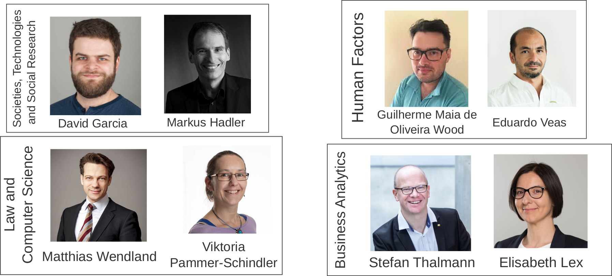

```{r xaringan-themer, include=FALSE, warning=FALSE}
#This block contains the theme configuration for the CSS lab slides style
library(xaringanthemer)
library(showtext)
style_mono_accent(
  base_color = "#5c5c5c",
  text_font_size = "1.5rem",
  header_font_google = google_font("Arial"),
  text_font_google   = google_font("Arial", "300", "300i"),
  code_font_google   = google_font("Fira Mono")
)
```

```{r setup, include=FALSE}
options(htmltools.dir.version = FALSE)
```

layout: true

<div class="my-footer"><span>David Garcia - Introduction to Computational Social Systems - TU Graz and University of Graz</span></div> 

---

# Course objectives
	
Learning an overview of approaches to Computational Social Systems from the perspectives of:

- Computer Science
- Sociology
- Business Administration
- Psychology 
- Law studies

Students will become familiar with the **interdisciplinary bridges** between approaches and how **current research** is connecting disciplines. 

A successful student of this course will be able to **discuss a topic** in Computational Social Systems from the viewpoint of **various disciplines**.

---

# Tandems
<center>

The course is structured in four tandems, each with two lecturers. Each tandem has a lecturer with a Computer Science background from TU Graz and a lecturer from University of Graz with experience in one of the other four disciplines.

---
# Lecturers


---

# Course calendar
.pull-left[
- Oct 4: Course introduction  
- Oct 11: **No morning lecture**  
*CSS  program inauguration (16:30)*
- Oct 18: Markus Hadler
- Oct 25: David Garcia
- Nov 8: Guilherme  
Maia de Oliveira Wood
- Nov 15: Eduardo Veas
]
.pull-right[
- Nov 22: Matthias Wendland
- Nov 29: Viktoria Pammer-Schindler
- Dec 6: Stefan Thalmann
- Dec 13: Elisabeth Lex

*Christmas break*
- Jan 10: Student presentations
- Jan 17: Student presentations
- Jan 24: Student presentations and wrap-up
]

.center[** From October 18th: HS10.01 on Mondays 10:45-12:45**]


---

# Student projects

- Course evaluation is based on group student projects
- Project aim: preparation for empirical analysis to be done in other courses (e.g. Foundations of Computational Social Systems)
- Lecturers will propose topics and suggested readings by Oct 25th
- You can select your own topic if it's related to Computational Social Systems
- Suggested parts for the project:  

  - Topic motivation and relevance for research and society at large
  - Brief literature review on the topic
  - Cases on the topic, possibly including practical examples
  - Interdisciplinary considerations and differences between approaches
  - Students' position on the topic: questions and ideas
  

---

# Course assessment


- Student projects should be developed during the course and presented in one of the last three sessions

- Course lecturers can ask questions to the students after each presentation

-  By the end of the course, a short written report on the project has to be submitted (max 6 pages, single column, 11pt)

- The grading scheme for the course is 50% for the presentation and 50% for the report 

*Two additional dates will be announced for written replacement examination dates, but we encourage students to participate in the student projects instead.*

---

# Student groups

- Student groups for the projects can contain at most 4 students

- Each student group must mix students from at least two different majors in the programme

- Groups can be the same as in Foundations of CSS, but not necessarily

- Send the list of group names to css@tugraz.at before Oct 25th

- All students in the group should participate in the project work, the report writing, and the presentation. If problems arise, contact  css@tugraz.at

---


# Keeping up to date

- CSS Programme Discord: https://discord.gg/qQYhh8vn

- Teach center: https://tc.tugraz.at/main/course/view.php?id=4069

.pull-left[
- Forum in teach center (Discord is preferred)

- Course webpage: www.dgarcia.eu/introductiontocss

- Email for more questions: css@tugraz.at
]
.pull-right[
.center[Discord server QR code:
]
]
---

# Questions?

.center[]


